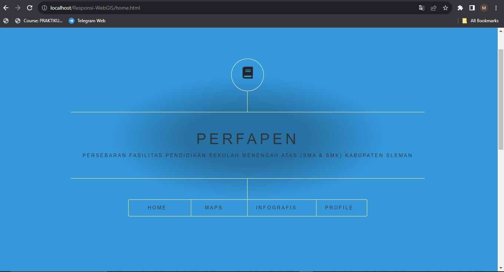
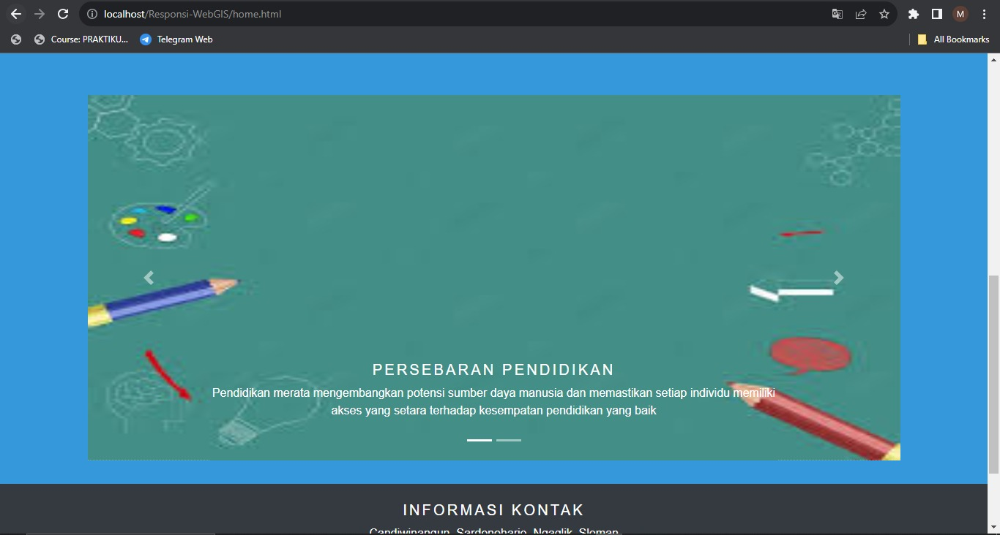
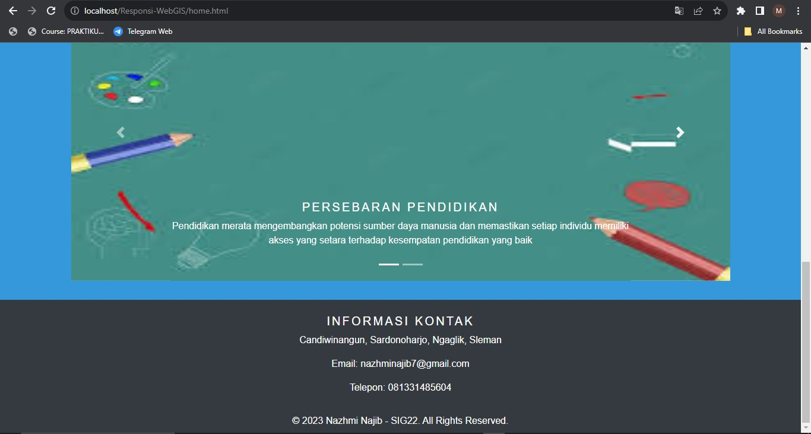
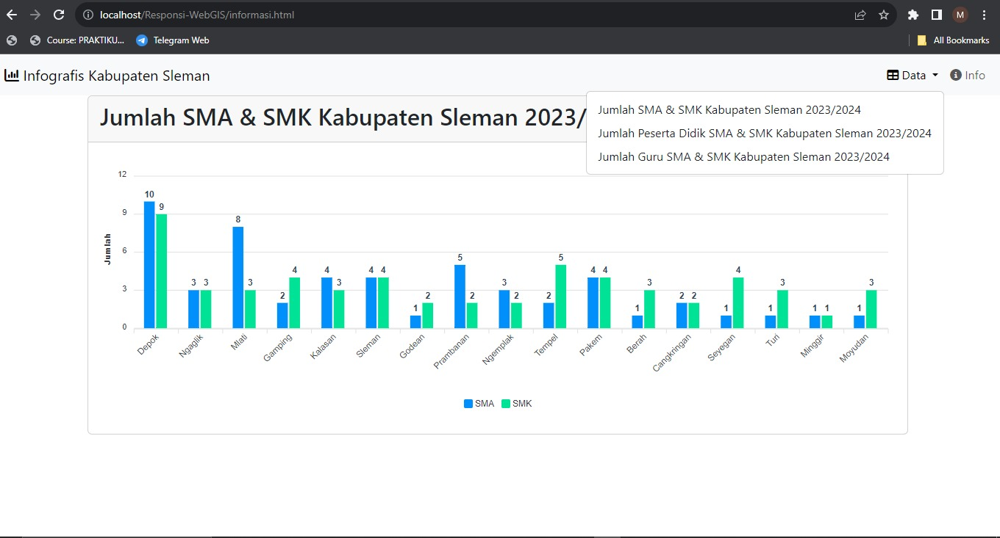
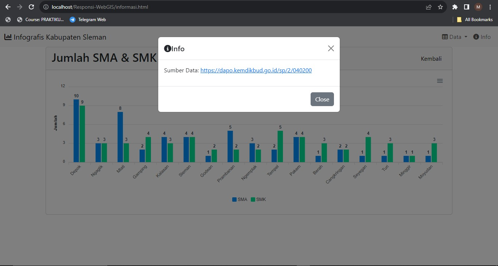
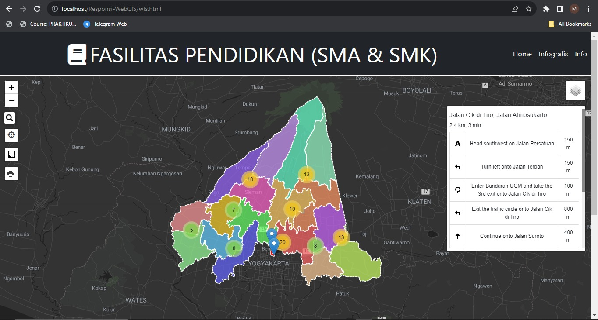
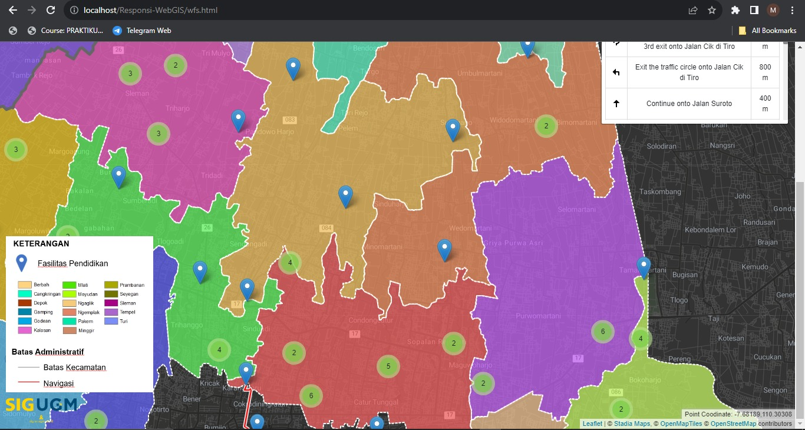
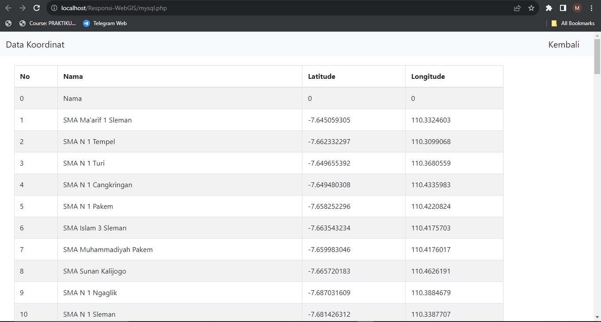
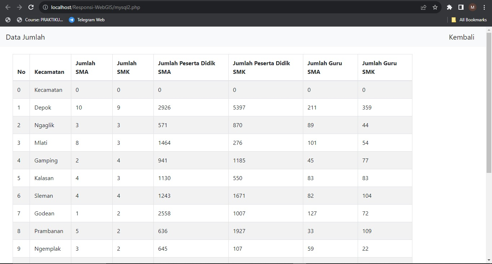
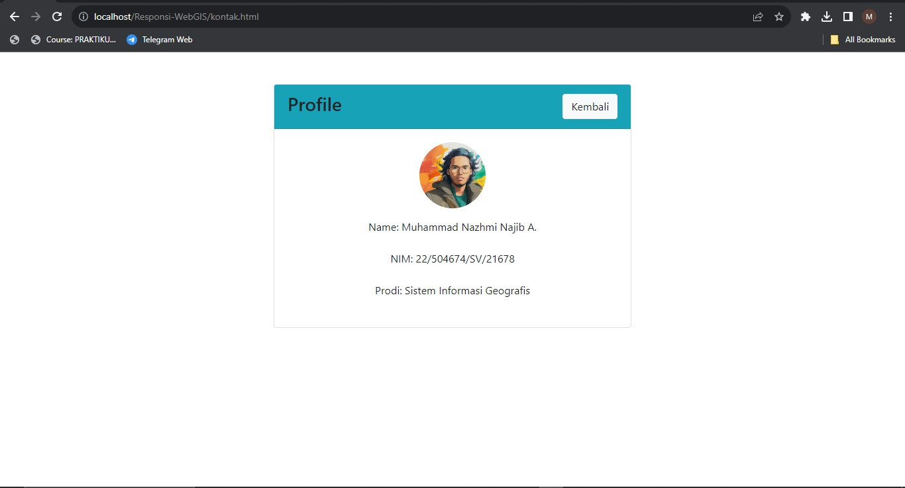

# RESPONSI PGWEB

**Responsi Praktikum Pemrograman Geospasial Web**

# PERFAPEN
**PERSEBARAN FASILITAS PENDIDIKAN SEKOLAH MENENGAH ATAS (SMA & SMK) KABUPATEN SLEMAN**

*Deskripsi Produk*
**Peta persebaran fasilitas pendidikan SMA & SMK Kabupaten Sleman bertujuan untuk mengetahui persebaran faspen sehingga dapat dilakukan analisis perencanaan dan pembangunan fasilitas pendidikan Kabupaten Sleman. Pemanfaatan persebaran fasilitas pendidikan dapat digunakan untuk melakukan pengolahan data lanjutan dengan beberapa komponen tambahan. Mempunyai infografis dan juga tabel jumlah fasilitas pendidikan kabupaten sleman per kecamatan untuk memudahkan penyampaian data** 

*Komponen Pembangun Produk*
**Leaflet.JS, Bootstrap, Database, GeoJSON**

*Sumber Data*
(https://dapo.kemdikbud.go.id/sp/2/040200, https://sekolah.data.kemdikbud.go.id/)

*Komponen Penting Produk*

*Profil*

**Nama : Muhammad Nazhmi Najib A.** 

**NIM  : 22/504674/SV/21678**

**Prodi: SIG 22**

